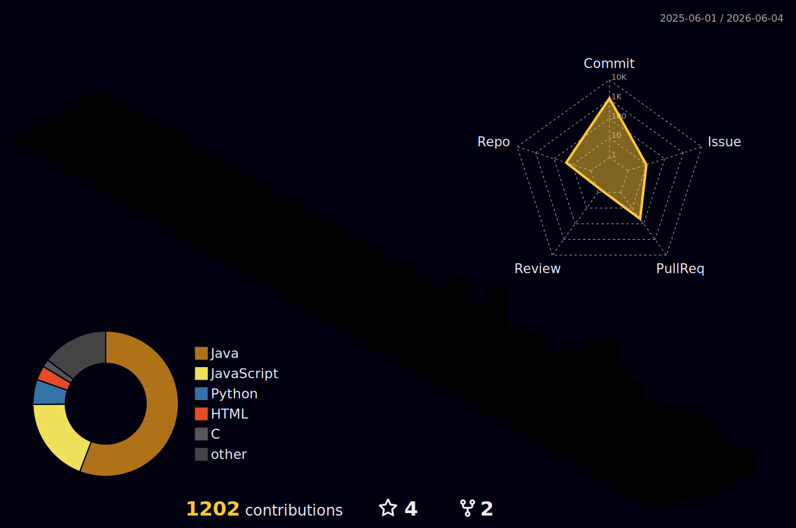

<div align="center">


<br/>

[](https://git.io/typing-svg)

</div>

<br/>

---

```java
class Harshith {

    String   location   = "Hyderabad, India";
    String   degree     = "B.Tech CSE @ CMR Technical Campus (CGPA: 8.84)";
    String   status     = "2nd year undergrad | Expected 2028";

    String[] building   = {
        "Contributing to Rocket.Chat — targeting GSoC 2026",
        "LeetCode Discord Reporter — auto-posts daily solves via GitHub Actions"
    };

    String[] grinding   = {
        "LeetCode | CodeChef | Codeforces | SmartInterviews",
        "daily contests — consistency over everything"
    };

    String   openTo     = "Internships · OSS · Interesting problems";
}
```

<br/>

---

## ◾ GitHub Stats

<div align="center">


&nbsp;&nbsp;


</div>

<div align="center">

[](https://github.com/Harshith1702)

</div>

<br/>

---

## ◾ Contribution Graph

<div align="center">

[](https://github.com/Harshith1702)

</div>

<br/>

---

## ◾ 3D Contribution Calendar

<div align="center">



</div>

> *auto-updates daily via GitHub Actions*

<br/>

---

## ◾ Snake

<div align="center">

<picture>
  <source media="(prefers-color-scheme: dark)" srcset="https://raw.githubusercontent.com/Harshith1702/Harshith1702/output/github-snake-dark.svg" />
  <source media="(prefers-color-scheme: light)" srcset="https://raw.githubusercontent.com/Harshith1702/Harshith1702/output/github-snake.svg" />
  
</picture>

</div>

<br/>

---

## ◾ Competitive Programming

<div align="center">

[](https://leetcode.com/u/Harshith-2007/)
[](https://www.codechef.com/users/harshith_2007)
[](https://codeforces.com/profile/harshaharshith31)
[]([https://www.smartinterviews.in/](https://smartinterviews.in/profile/harshaharshith31))

</div>

<div align="center">

[](https://leetcode.com/u/Harshith-2007/)

</div>

<br/>

---

## ◾ Open Source

**Rocket.Chat** — targeting GSoC 2026
> Working on fix for [#39376](https://github.com/RocketChat/Rocket.Chat/issues/39376) — timestamps not parsed inside bold/italic markdown

**LeetCode Discord Reporter** · [`Harshith1702/leetcode-discord-reporter`](https://github.com/Harshith1702/leetcode-discord-reporter)
> Posts daily solved problems to Discord at 10:15 PM IST — GitHub Actions + cron-job.org + session auth

<br/>

---

## ◾ Projects

<div align="center">

| Project | Stack | Link |
|:---|:---|:---:|
| **Open Chat App** — real-time rooms, password-protected, typing indicators, 100-user cap | `Node.js` `Express` `Socket.IO` | [**Live ↗**](https://open-chat-application-ubti.onrender.com) · [**Code**](https://github.com/Harshith1702/Open_Chat_Application) |
| **Eclipse Attendance** — QR-based, teacher/student dashboards, CSV export, 100% browser | `HTML` `CSS` `JS` | [**Code**](https://github.com/Harshith1702/eclipse-attendance-app) |
| **Social Media Follower System** — graphs from scratch: follow/unfollow, mutual suggestions | `C` `DSA` | [**Code**](https://github.com/Harshith1702/Social_Media_Follower_System_C) |

</div>

<br/>

---

## ◾ Stack

<div align="center">


</div>

<br/>

---

## ◾ Connect

<div align="center">

[](mailto:harshaharshith31@gmail.com)
[](https://www.linkedin.com/in/harshith-p-17022007v/)
[](https://leetcode.com/u/Harshith-2007/)
[](https://github.com/Harshith1702)

</div>

<br/>

---

<div align="center">


</div>
