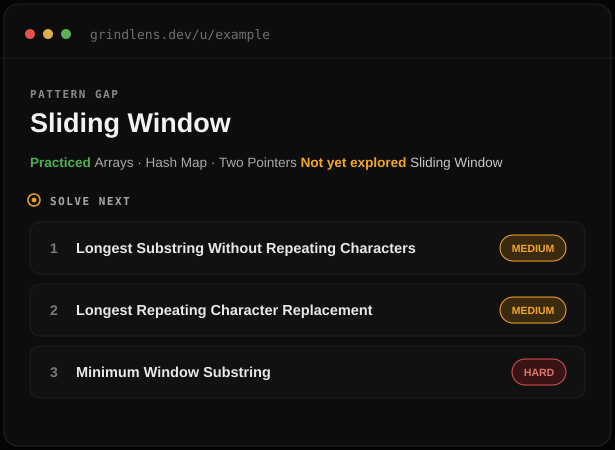

<div align="center">


<br/>

[](https://git.io/typing-svg)

[](https://grindlens.dev)
[](https://www.linkedin.com/in/harshith-padakanti)
[](https://harshith-padakanti.vercel.app)
[](https://leetcode.com/u/Harshith-2007)


</div>


## ◾ GrindLens



name your 3 weakest DSA topics right now. from memory. no sheet open, no stats page, just what you remember.

most people can't. i couldn't either, and i'd already solved 400+ problems at that point.

that gap is the whole reason GrindLens exists. not another streak tracker. it tracks what you've actually covered against what you've been quietly avoiding, and it comes with sheets, Blind 75, NeetCode 150, company-tagged sets, or your own, so the gap it finds turns into something you can actually go fix.

**[grindlens.dev](https://grindlens.dev)** — no signup wall to look around, log in with LeetCode and see where you actually stand.

Building it solo, in public, right now. Every redesign is one less thing that made it look like a template. If you use it and something's off, that's not a bug report, that's the roadmap. [Tell me on LinkedIn](https://www.linkedin.com/in/harshith-padakanti) or drop it in an email.


```bash
┌─[harshith@dev]─[~]
│
├── location    : hell i guess
├── degree      : B.Tech CSE @ CMR Technical Campus (CGPA: 8.52)
├── status      : 3rd year undergrad | Expected 2028
├── portfolio   : https://harshith-padakanti.vercel.app
│
├── building    : GrindLens — leetcode analytics, grindlens.dev
│                 GSSoC 2026 | NSoC 2026 (30+ PRs, rank 70/988) 
│                 LeetCode Discord Reporter — live | zero maintenance
│
├── grinding    : LeetCode (400+) | CodeChef | Codeforces | SmartInterviews
│                 daily. consistency over everything.
│
└── open to     : Backend Internships | OSS | Interesting problems
```

<div align="center">

<!-- LEETCODE-STATS:START -->
`449 solved` · `1588 rating` · synced `Sep 1, 2026`
<!-- LEETCODE-STATS:END -->

*this line updates itself. [see the workflow](./.github/workflows/update-readme.yml)*

</div>

## ◾ About

Backend dev. Hyderabad. 3rd year. I write code that works, ships, and doesn't need me to explain it.

Node.js, Socket.IO, Java, real-time systems, DSA daily.

Looking for backend internships.


## ◾ Open Source

### Rocket.Chat

3 PRs into `develop`. Reviewed and consolidated by Gazzo into batch PR [#39853](https://github.com/RocketChat/Rocket.Chat/pull/39853) with 9 other contributors.

- [#39455](https://github.com/RocketChat/Rocket.Chat/pull/39455) — timestamp parsing inside formatted text. it was broken.
- [#39737](https://github.com/RocketChat/Rocket.Chat/pull/39737) — test coverage for `isNodeOfType` guard. had none.
- [#39733](https://github.com/RocketChat/Rocket.Chat/pull/39733) — emoji behavior tests in `reducePlainTexts`. also broken.

### GSSoC 2026 — ongoing

**SkillsSphere AI** — socket status indicator, dead code removal, light mode fixes across classroom UI.
[#556](https://github.com/swayam03275/SkillsSphere-AI/pull/556) · [#579](https://github.com/swayam03275/SkillsSphere-AI/pull/579) · [#592](https://github.com/swayam03275/SkillsSphere-AI/pull/592) · [#600](https://github.com/swayam03275/SkillsSphere-AI/pull/600)

**GSoC Org Finder** — corrected mentor contact info for a dozen orgs. someone had to.
[#544](https://github.com/S3DFX-CYBER/GSoC-Org-Finder-/pull/544) · [#549](https://github.com/S3DFX-CYBER/GSoC-Org-Finder-/pull/549) · [#583](https://github.com/S3DFX-CYBER/GSoC-Org-Finder-/pull/583) · [#590](https://github.com/S3DFX-CYBER/GSoC-Org-Finder-/pull/590) · [#639](https://github.com/S3DFX-CYBER/GSoC-Org-Finder-/pull/639) · [#643](https://github.com/S3DFX-CYBER/GSoC-Org-Finder-/pull/643) · [#649](https://github.com/S3DFX-CYBER/GSoC-Org-Finder-/pull/649)

**Reframe** — memory leak on export failure. CDN hints for FFmpeg.
[#310](https://github.com/magic-peach/reframe/pull/310) · [#311](https://github.com/magic-peach/reframe/pull/311)

**Eventra** — localStorage draft persistence. toast was in the wrong place.
[#1256](https://github.com/SandeepVashishtha/Eventra/pull/1256) · [#1194](https://github.com/SandeepVashishtha/Eventra/pull/1194)

**Cara** — button text wasn't visible. [#255](https://github.com/janavipandole/Cara/pull/255)

### NSoC 2026 — 30+ PRs merged, ranked 70/988

UI bugs. Backend logic. API pagination. Response envelopes. URL state encoding. Form drafts. Resume parsing. AI inputs. JavaScript, TypeScript, Python.

it got done.


## ◾ Other Projects

<div align="center">

| Project | Description | Stack | Link |
|:---|:---|:---|:---:|
| *Open Chat App* | Real-time rooms, password-protected, typing indicators, 100-user cap | Node.js Express Socket.IO | [Live ↗️](https://open-chat-application-ubti.onrender.com) · [Code](https://github.com/Harshith1702/Open_Chat_Application) |
| *LeetCode Grind Tracker* | Full-stack tracker with Python sync pipeline, MySQL views, PHP API, and dashboard analytics | Python PHP MySQL JavaScript | [Code](https://github.com/Harshith1702/leetcode-grind-tracker) |
| *LeetCode Discord Reporter* | Fetches accepted submissions daily, posts to Discord at 10:15 PM IST automatically | GitHub Actions cron-job.org | [Code](https://github.com/Harshith1702/leetcode-discord-reporter) |
| *Social Media Follower System* | Graph-based: follow/unfollow, mutual suggestions | C DSA | [Code](https://github.com/Harshith1702/Social_Media_Follower_System_C) |
| *Eclipse Attendance* | QR-based, teacher/student dashboards, CSV export, fully browser-side | HTML CSS JS | [Code](https://github.com/Harshith1702/eclipse-attendance-app) |
| *Smart Dustbin* | IR sensor + servo motor automation | Arduino C++ IoT | — |
| *Web Scraper* | Data extraction in Java + Python using Jsoup + BeautifulSoup | Java Python | [Code](https://github.com/Harshith1702/Web_Scraper) |

</div>


## ◾ Competitive Programming

<div align="center">

[](https://leetcode.com/u/Harshith-2007/)
[](https://www.codechef.com/users/harshith_2007)
[](https://codeforces.com/profile/harshaharshith31)
[](https://smartinterviews.in/profile/harshaharshith31)

400+ problems solved · 55+ contests · 1720 max rating

[](https://leetcode.com/u/Harshith-2007/)

</div>


## ◾ GitHub

<div align="center">


&nbsp;&nbsp;


[](https://git.io/streak-stats)

[](https://github.com/Harshith1702)

[](https://github.com/Harshith1702)

<picture>
  <source media="(prefers-color-scheme: dark)" srcset="https://raw.githubusercontent.com/Harshith1702/Harshith1702/output/github-contribution-grid-snake-dark.svg"/>
  <source media="(prefers-color-scheme: light)" srcset="https://raw.githubusercontent.com/Harshith1702/Harshith1702/output/github-contribution-grid-snake.svg"/>
  
</picture>

</div>


## ◾ Core Concepts

- REST APIs, WebSockets, Real-Time Communication
- Data Structures, Problem Solving
- OOP, Backend Development
- CI/CD, Automation, Testing
- Open Source, Competitive Programming


<div align="center">

*open to backend internships. open to interesting problems. not open to small talk.*

*profile views don't matter. projects do.*

</div>


